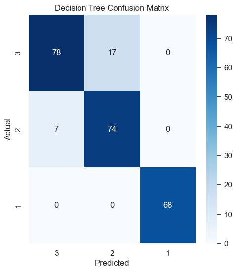
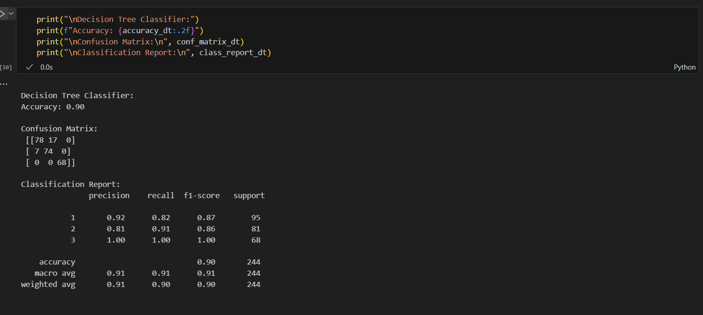
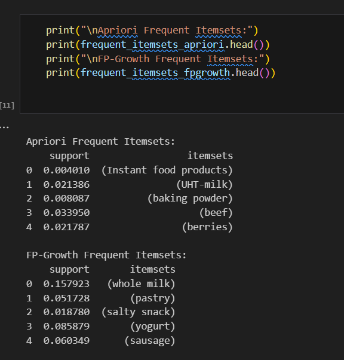
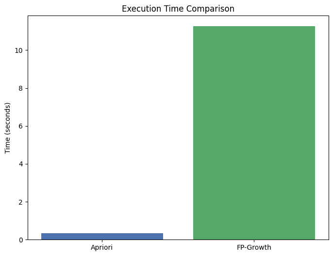

# Health & Fitness Data Mining

This project explores various machine learning and data mining techniques on a health and fitness dataset. The analysis covers supervised learning (classification & regression), unsupervised learning (clustering), and pattern discovery (association rules), along with visualizations and evaluation metrics.

## 📊 Dataset Overview

The dataset includes features related to health, nutrition, and physical activity. A sample preview is shown below:

---

## 🌳 Decision Tree Classifier

A Decision Tree model was trained to classify health conditions.

* **Accuracy:** 90%

* **Confusion Matrix:**
  
  

* **Classification Report:**
  

---

## 📉 Feature Importance

The most impactful features were extracted using the Decision Tree model:

---

## 📈 Regression Analysis

A regression model was used to predict a continuous health-related variable. Evaluation metrics:

* **Report:**
  

* **Actual vs Predicted Plot:**
  

---

## 🔗 K-Means Clustering

K-Means clustering was applied to group users into clusters based on their health profile.

* **Elbow Method:**
  

* **Silhouette Scores:**
  

* **Final Clusters Visualization (with PCA):**
  

---

## 🧾 Association Rules

Both Apriori and FP-Growth algorithms were used for mining association rules from transactional health data.

* **Rules Output:**
  

* **Support & Confidence Comparison:**
  

* **Execution Time Comparison:**
  

---

## 📦 Tools & Technologies

* Python (Pandas, Scikit-learn, Matplotlib, Seaborn)
* Jupyter Notebook

---

## ✅ Conclusion

This project demonstrates a full machine learning pipeline including data preparation, model building, evaluation, and visualization. It highlights how data mining techniques can provide valuable insights to improve health and fitness decisions.
